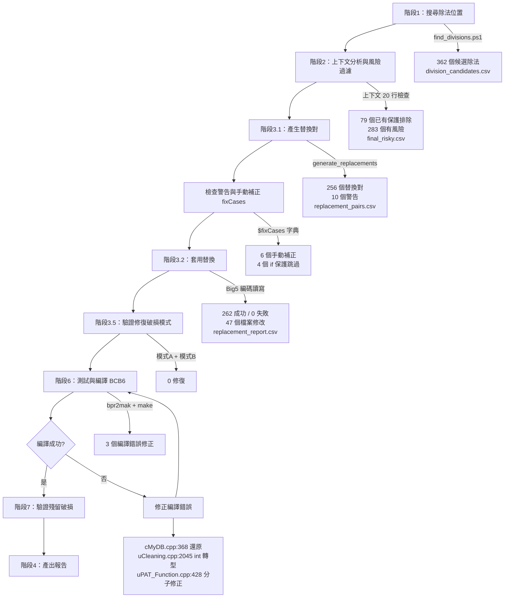

# 除法安全替換報告

**專案**：HT9045 (`HT9011UC_Code_V3.33.897.0_20260306`)  
**日期**：2026-03-06 11:51:22  
**作者**：Steven  
**使用模板**：`ChangeToFloatNonPcnt<T>(Numerator, Denominator)`（定義於 MachineType.h）  
**模板行為**：除數為 0 時回傳 0，否則回傳 `(double)Numerator/(double)Denominator`

---

## 摘要

| 項目 | 數量 |
|------|------|
| 掃描 .cpp 檔案數 | 327 |
| 原始除法候選 | 362 |
| 已有保護（排除） | 79 |
| 未受保護的有風險除法 | 283 |
| 編譯時常數（跳過） | 27 |
| 空分子警告（手動處理） | 10 |
| fixCases 手動補正 | 6 |
| if 保護跳過（警告中） | 4 |
| **實際替換數** | **262** |
| **修改檔案數** | **47** |
| 編譯錯誤修正 | 3 |
| 驗證修復（模式A+B） | 0 |
| 最終編譯結果 | **EXIT=0（成功）** |

---

## 流程圖



---

## 跳過的編譯時常數

以下除數為 `MachineType.h` 中定義的編譯時常數，絕不會為 0，故排除替換：

| 常數名稱 | 出現次數 | 排除原因 |
|----------|----------|----------|
| MAX_SAFE_DOOR_CNT | - | 編譯時常數，不會為 0 |
| MAX_HATCH_DOOR_CNT | - | 編譯時常數，不會為 0 |
| MAX_ARM_Row / MAX_ARM_Col | - | 編譯時常數，不會為 0 |
| MAX_Index_Row / MAX_Index_Col | - | 編譯時常數，不會為 0 |
| MAX_SOCKET_ROW / COL / TOTAL | - | 編譯時常數，不會為 0 |
| MAX_SENSOR_ITEM | - | 編譯時常數，不會為 0 |
| MAX_TTL_BIT | - | 編譯時常數，不會為 0 |
| MAX_IONFAN | - | 編譯時常數，不會為 0 |
| MAX_AUTO_TRAY / MAX_TRACK | - | 編譯時常數，不會為 0 |
| MAX_FIX_TRAY / MAX_UNLOAD_TRAY | - | 編譯時常數，不會為 0 |
| MAX_MGZ_TRAY | - | 編譯時常數，不會為 0 |
| RecordTrayCnt | - | 編譯時常數，不會為 0 |

---

## 特殊案例

### 編譯錯誤修正

| 檔案:行號 | 原因 | 處理方式 |
|-----------|------|----------|
| cMyDB.cpp:368 | 多行運算式跨 3 行，分子反向掃描只處理行 368 產生斷裂括弧；且該除法已在 line 364 受 `if(LastSet.iJamCount[2]!=0)` 保護 | **還原為原始程式碼** |
| uCleaning.cpp:2045 | 原始碼 `(iPos/udDeviceCT->Increment)%2` 使用整數除法結果做模運算，替換後 `ChangeToFloatNonPcnt` 回傳 float 不可用 `%` | **加 (int) 轉型**：`((int)ChangeToFloatNonPcnt(...))%2` |
| uPAT_Function.cpp:428 | 分子反向掃描將 `LastSet.SystemAccSecond[0][stPauseTime]` 中的 `[stPauseTime]` 誤判為獨立分子，產生 `LastSet.SystemAccSecond[0]ChangeToFloatNonPcnt((double)([stPauseTime]), ...)` | **修正分子**：改為 `ChangeToFloatNonPcnt((double)(LastSet.SystemAccSecond[0][stPauseTime]), (double)(GetTotalContactCount()))` |

### fixCases 手動補正（空分子）

| 檔案:行號 | 原始除法 | 分子 | 分母 |
|-----------|----------|------|------|
| ainarm9045.cpp:5849 | `MOT[MMTrayY].Tray.XItem / LoadForm->BlockXItem` | `MOT[MMTrayY].Tray.XItem` | `LoadForm->BlockXItem` |
| ainarm9045.cpp:5850 | `MOT[MMTrayY].Tray.YItem / LoadForm->BlockYItem` | `MOT[MMTrayY].Tray.YItem` | `LoadForm->BlockYItem` |
| Magazine.cpp:585 | `MOT[Motor].Tray.XItem / AutoForm[iWhichAuto]->BlockXItem` | `MOT[Motor].Tray.XItem` | `AutoForm[iWhichAuto]->BlockXItem` |
| Magazine.cpp:586 | `MOT[Motor].Tray.YItem / AutoForm[iWhichAuto]->BlockYItem` | `MOT[Motor].Tray.YItem` | `AutoForm[iWhichAuto]->BlockYItem` |
| mySYNTEKmotor.cpp:273 | `dScaleSpeed / PJogHighSpeed` | `dScaleSpeed` | `PJogHighSpeed` |
| SortingBinTray.cpp:1736 | `(CalData.iUseTray[iTX][iTY]-1 - iSX) / SuckData->iXItem` | `(CalData.iUseTray[iTX][iTY]-1 - iSX)` | `SuckData->iXItem` |

### 跳過的警告（已有 if 保護）

| 檔案:行號 | 原因 |
|-----------|------|
| SortingBinTray.cpp:1481 | 位於 `if(TrayData.iXPitch != 0)` 區塊內 |
| SortingBinTray.cpp:1485 | 位於 `if(TrayData.iXPitch != 0)` 區塊內 |
| SortingBinTray.cpp:1647 | 位於 `if(TrayData.iYPitch != 0)` 區塊內 |
| SortingBinTray.cpp:1652 | 位於 `if(TrayData.iYPitch != 0)` 區塊內 |

---

## 各檔案替換明細

| # | 檔案名稱 | 替換數 |
|---|----------|--------|
| 1 | CAlignmentB.cpp | 28 |
| 2 | InOutArmZteach.cpp | 25 |
| 3 | cinitial.cpp | 16 |
| 4 | ainarm9045.cpp | 15 |
| 5 | SortingBinTray.cpp | 13 |
| 6 | AutoAlignment.cpp | 12 |
| 7 | uHGemEquipment.cpp | 11 |
| 8 | main.cpp | 11 |
| 9 | aoutarm.cpp | 11 |
| 10 | mySMCmotor.cpp | 10 |
| 11 | fRotate.cpp | 8 |
| 12 | csystem.cpp | 7 |
| 13 | HTMC88X1Motor.cpp | 7 |
| 14 | aoutarm9045.cpp | 7 |
| 15 | myMN200motor.cpp | 5 |
| 16 | AutoClean.cpp | 5 |
| 17 | cpublic.cpp | 5 |
| 18 | Magazine.cpp | 5 |
| 19 | cContact.cpp | 5 |
| 20 | uCleaning.cpp | 3 |
| 21 | mymotor.cpp | 3 |
| 22 | SECSGEM.cpp | 3 |
| 23 | mySYNTEKmotor.cpp | 3 |
| 24 | ProductionInfo.cpp | 3 |
| 25 | fDTME08.cpp | 3 |
| 26 | uPAT_Function.cpp | 3 |
| 27 | aTester_Rear.cpp | 3 |
| 28 | aTester_Front.cpp | 3 |
| 29 | cContactCT.cpp | 3 |
| 30 | myTimer.cpp | 3 |
| 31 | uMotorTest.cpp | 3 |
| 32 | cObserver.cpp | 2 |
| 33 | mykitsuck.cpp | 2 |
| 34 | cMyDB.cpp | 2 |
| 35 | uYieldMonitoring.cpp | 2 |
| 36 | uHGemClass.cpp | 1 |
| 37 | tools.cpp | 1 |
| 38 | cConfiguration.cpp | 1 |
| 39 | AutoTemperature.cpp | 1 |
| 40 | atester.cpp | 1 |
| 41 | note.cpp | 1 |
| 42 | ATCSystem.cpp | 1 |
| 43 | uLotInfo.cpp | 1 |
| 44 | FixAICCD.cpp | 1 |
| 45 | cTrayMapping.cpp | 1 |
| 46 | BarCode.cpp | 1 |
| 47 | mymessbox.cpp | 1 |

---

## 替換範例

### 範例 1：CAlignmentB.cpp:1235 — 簡單變數除法

**替換前**
```cpp
iX120PitchCountAvg/iCnt
```

**替換後**
```cpp
ChangeToFloatNonPcnt((double)(iX120PitchCountAvg), (double)(iCnt))
```

**說明**：`iCnt` 為計數器變數，當無有效計數時可能為 0，導致除以零崩潰。

---

### 範例 2：ainarm9045.cpp:7905 — 括號運算式分子

**替換前**
```cpp
(iMotPulse-Prod.iInArmY15Pitch)/m
```

**替換後**
```cpp
ChangeToFloatNonPcnt((double)((iMotPulse-Prod.iInArmY15Pitch)), (double)(m))
```

**說明**：分子為括號包覆的減法運算式，分母 `m` 為動態計算的間距值。

---

### 範例 3：main.cpp:32497 — 結構成員存取除法

**替換前**
```cpp
(sgTemp[i]->Width-10)/sgTemp[i]->ColCount
```

**替換後**
```cpp
ChangeToFloatNonPcnt((double)((sgTemp[i]->Width-10)), (double)(sgTemp[i]->ColCount))
```

**說明**：分母為 UI 元件的欄位數 `ColCount`，若 StringGrid 未初始化則可能為 0。

---

### 範例 4：mySMCmotor.cpp:865 — 馬達齒輪比

**替換前**
```cpp
lValue/GearRatio
```

**替換後**
```cpp
ChangeToFloatNonPcnt((double)(lValue), (double)(GearRatio))
```

**說明**：`GearRatio` 為馬達齒輪比參數，若設定檔載入失敗可能為 0。

---

### 範例 5：cinitial.cpp:14120 — 函式呼叫分子 + 成員鏈分母

**替換前**
```cpp
GetSHCHKPos(iLineNo, SThreadPara.base_InposY[iShuttleNo])/MOT[MInShuttle1].Motor->GearRatio
```

**替換後**
```cpp
ChangeToFloatNonPcnt((double)(GetSHCHKPos(iLineNo, SThreadPara.base_InposY[iShuttleNo])), (double)(MOT[MInShuttle1].Motor->GearRatio))
```

**說明**：分子為帶有複雜引數的函式呼叫，分母為多層成員存取鏈 `MOT[].Motor->GearRatio`。此案例展示了分子反向掃描對函式呼叫的完整解析能力，以及分母正向掃描對 `[]` `.` `->` 成員鏈的支援。

---

## 安全除法模板定義

```cpp
// MachineType.h
template <class T>
float ChangeToFloatNonPcnt(const T Numerator, const T Denominator)
{
    double str=0.00;
    if(Denominator!=0)
       str= ((double)Numerator/(double)Denominator);
    return str;
};
```

---

## 中繼檔案

| 檔案 | 說明 |
|------|------|
| search-division/division_candidates.csv | 原始除法候選清單（362 筆） |
| search-division/final_risky.csv | 過濾後的有風險除法清單（283 筆） |
| search-division/replacement_pairs.csv | 替換對 — 舊→新（256 筆） |
| search-division/replacement_report.csv | 替換執行結果（262 筆，全部成功） |

---

## AI 使用提示詞

以下為使用者對 AI 的指示（原文）：

> 跟據 SKILL.md 尋找cpp檔案中, 針對可能會除以0的條列, 將上面找到的地方都使用ChangeToFloatNonPcnt模板取代。
> 請製作一份新的報告, 格式為 .md 與 .html, 內容包含5個 .cpp範例。
> 將上面的全部動作做成一個流程圖。
> 並且在報告中加上我對AI使用的提示詞。
> 報告內容必須使用繁體中文。

---

## 執行步驟摘要

| 步驟 | 動作 | 結果 |
|------|------|------|
| 1 | 確認目標目錄 `HT9011UC_Code_V3.33.897.0_20260306` | 327 個 .cpp 檔案 |
| 2 | 階段1 — 搜尋除法位置 | 362 個候選除法 |
| 3 | 階段2 — 上下文保護過濾 | 283 個有風險（79 個已有保護排除） |
| 4 | 階段3.1 — 產生替換對 | 256 個替換對 + 10 個警告 |
| 5 | 檢查警告，補正 fixCases | 6 個手動補正，4 個 if 保護跳過 |
| 6 | 階段3.2 — 套用替換 | 262 成功 / 0 失敗，47 個檔案修改 |
| 7 | 階段3.5 — 驗證修復 | 模式A=0，模式B=0 |
| 8 | 測試與編譯 (BCB6) | 3 個編譯錯誤修正後 EXIT=0 |
| 9 | 驗證殘留破損 | 0 殘留 |
| 10 | 產出報告 | .md + .html |
