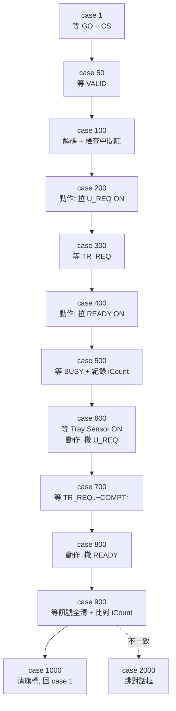

# RD5軟體 — HT9045 V899 E84 Handler 端動作 / 判斷深度解析

> 版本：HT9011UC_Code_V3.33.899.0_20260323_Jimmy_20260422
> 來源檔：[Automation/AGV.cpp](../HT9011UC_Code_V3.33.899.0_20260323_Jimmy_20260422/Automation/AGV.cpp)
> 產生時間：2026-04-23 15:00:00

---

## 0. 前置條件（每個 tick 都要成立，狀態機才會跑）

`DoE84Loader()` / `DoE84Unloader()` 是被 `Timer2Timer` 呼叫，但有以下硬性前置：

| 條件 | 說明 | 程式位置 |
|------|------|---------|
| `fNote->fShow == true` | E84 監看視窗有開 | [Timer2Timer L1300](../HT9011UC_Code_V3.33.899.0_20260323_Jimmy_20260422/Automation/AGV.cpp#L1300) |
| `InitialOK == true` | 系統初始化已完成 | 同上 |
| `bIn` 互斥旗 | 避免兩次 Timer 同時進入 | 同上 |
| **強制每 tick 寫入** `SW[SwE84_x_ES].On()` | 表示無 EMO | LOAD [L239](../HT9011UC_Code_V3.33.899.0_20260323_Jimmy_20260422/Automation/AGV.cpp#L239)、UNLOAD [L601](../HT9011UC_Code_V3.33.899.0_20260323_Jimmy_20260422/Automation/AGV.cpp#L601) |
| **強制每 tick 寫入** `SW[SwE84_x_HOAVBL].On()` | 表示 Equipment 可用 | LOAD [L240](../HT9011UC_Code_V3.33.899.0_20260323_Jimmy_20260422/Automation/AGV.cpp#L240)、UNLOAD [L602](../HT9011UC_Code_V3.33.899.0_20260323_Jimmy_20260422/Automation/AGV.cpp#L602) |

> ?? 重點：HO_AVBL / ES **不論機台 Alarm、Door Open、Buffer 滿料一律 ON**，這是 V899 設計上的弱點（前一份相容性報告已列為 ? 高優先弱點）。

---

## 1. LOAD 流程（`DoE84Loader()`）— Handler 在每個 case 裡到底「動了什麼」

### 1.1 流程概覽（先看大局）



### 1.2 各 case Handler 動作 / 判斷詳解

#### **case 1 — 等 AGV 上門**（[L244-L264](../HT9011UC_Code_V3.33.899.0_20260323_Jimmy_20260422/Automation/AGV.cpp#L244)）

| 觀察 / 動作 | 對象 | 為什麼 |
|------------|------|--------|
| 觀察 `SW[SwE84_1_HOAVBL].Status()` | 自己的 HO_AVBL 輸出 | 確認自己廣播「我可以接」 |
| 觀察 `Sen[SnE84_1_GO].IsOn()` | AGV 給的 GO 訊號 | 9045 自訂的「車到位」觸發；標準 SEMI 沒有此訊號 |
| 觀察 `Sen[SnE84_1_CS0/CS1]` 任一 ON | AGV 給的 buffer 選擇 | 確認 AGV 已經告訴我要放哪 |
| 動作：`E84LoadDelay.SetSecAndOn(TD0)` | 計時器 | 啟動「等 VALID」的看門狗 |
| 動作：把 `bCS0/bCS1/iCount` 重置 | 內部變數 | 為新一輪 cycle 清乾淨 |

> **沒判斷實體機構**，只看對方訊號。

---

#### **case 50 — 等 AGV 確認 CS 為真**（[L267-L279](../HT9011UC_Code_V3.33.899.0_20260323_Jimmy_20260422/Automation/AGV.cpp#L267)）

| 觀察 / 動作 | 對象 | 為什麼 |
|------------|------|--------|
| 觀察 `Sen[SnE84_1_VALID].IsOn()` | AGV 的 VALID | SEMI 規定：CS 訊號必須由 VALID 確認，避免電氣雜訊誤觸發 |
| 計時：TD0 內未到 → `Task=5000` | — | AGV 通電 CS 卻沒拉 VALID 通常代表訊號線斷或 AGV 軟體 bug |

> **沒判斷實體機構**。

---

#### **case 100 — 解碼 buffer + ? 檢查中間定位缸**（[L281-L325](../HT9011UC_Code_V3.33.899.0_20260323_Jimmy_20260422/Automation/AGV.cpp#L281)）

這是 LOAD 流程**第一個會檢查實體機構**的 case，也是你問題的核心。

| 動作順序 | 程式行為 | 物理意義 |
|---------|---------|----------|
| ヾ 讀 `Sen[SnE84_1_CS0]` / `Sen[SnE84_1_CS1]` 組合 | 解碼 `iPlaceWhichBuffer[0] ? {0,1,2}` | 0=Loader / 1=Empty / 2=Color |
| ゝ 若 CS0+CS1 都 OFF → `Task=100` 自迴圈 | 等待 AGV 給有效 CS | 沒有 timeout，會一直停在這 |
| ゞ **檢查 `Cylinder[C_MiddleIndex[i]].OffStatus() == true`** | 對應 Buffer 的「中間定位缸」必須在**收回（OFF）**位置 | 中間缸如果伸出（OFF status=false 表示在上方），會擋住 AGV 把 Tray 放下來，造成撞料 |
| 々 設 `bE84LoaderActionflag[i] = true` | 內部旗標 | 通知其他模組「這個 buffer 正在被 AGV 接料，不要動它」 |
| ぁ `E84LoadDelay.SetSecAndOn(TA1)` | 啟動 TA1 計時器 | 接下來最多 TA1 秒內必須拉 U_REQ |
| あ `Task = 200` | — | — |

> **? 關鍵實體判斷**：第 ゞ 步。三個中間定位缸對應到 [asendic.cpp](../HT9011UC_Code_V3.33.899.0_20260323_Jimmy_20260422/asendic.cpp) 裡 Loader/Empty/Color 區的「Tray 抓盤分離缸」。`OffStatus()==true` 在註解裡明確寫「**汽缸在下面**」（[asendic_Color.cpp#L97](../HT9011UC_Code_V3.33.899.0_20260323_Jimmy_20260422/asendic_Color.cpp#L97) 的反面）。

> ?? **缺陷**：如果中間缸卡在中間位置（OffStatus 既不是 true 也不是 false），這個 case **沒有 timeout** ，會卡死等待，直到操作員手動排除。

---

#### **case 200 — 拉 U_REQ ON：宣告「我準備好接料」**（[L327-L342](../HT9011UC_Code_V3.33.899.0_20260323_Jimmy_20260422/Automation/AGV.cpp#L327)）

| 動作 / 觀察 | 對象 | 物理意義 |
|------------|------|----------|
| **動作**：`SW[SwE84_1_UREQ].On()` | 自己的 U_REQ 輸出 | 通知 AGV：「我已就緒，請進站放料」 |
| `E84LoadDelay.SetSecAndOn(TP1)` | 計時器 | 接下來 TP1 秒內 AGV 必須回 TR_REQ |
| TA1 內 U_REQ 沒拉成功 → `Task=5000` | — | 通常是 IO 卡硬體問題 |

> **沒判斷實體機構**。

---

#### **case 300 — 等 AGV 答覆 TR_REQ**（[L343-L360](../HT9011UC_Code_V3.33.899.0_20260323_Jimmy_20260422/Automation/AGV.cpp#L343)）

| 觀察 / 動作 | 對象 | 物理意義 |
|------------|------|----------|
| 觀察 `Sen[SnE84_1_TRREQ].IsOn()` | AGV 的 TR_REQ | AGV 確認「OK，我要正式進站」 |
| 動作：`E84LoadDelay.SetSecAndOn(TA2)` | 計時器 | 拉 READY 的看門狗（120 秒，較寬鬆） |

> **沒判斷實體機構**。

---

#### **case 400 — 拉 READY ON：批准 AGV 動作**（[L361-L376](../HT9011UC_Code_V3.33.899.0_20260323_Jimmy_20260422/Automation/AGV.cpp#L361)）

| 動作 / 觀察 | 對象 | 物理意義 |
|------------|------|----------|
| **動作**：`SW[SwE84_1_READY].On()` | 自己的 READY 輸出 | 「許可你開始機構動作」 |
| 啟動 TP2 | — | 等 BUSY |

> **沒判斷實體機構**。注意：READY 拉 ON 後，AGV 才會啟動機械手放料，**此時 Handler 並沒有再去檢查中間缸是否仍在收回**——如果在 case 100 → 400 期間中間缸被別的程式弄上去，**就會撞料**。這是另一個潛在風險。

---

#### **case 500 — 等 BUSY + ? 對 CS 拍快照**（[L377-L417](../HT9011UC_Code_V3.33.899.0_20260323_Jimmy_20260422/Automation/AGV.cpp#L377)）

| 動作順序 | 程式行為 | 物理意義 |
|---------|---------|----------|
| ヾ 觀察 `Sen[SnE84_1_BUSY].IsOn()` | AGV 開始動作了 | AGV 機械手正下放 Tray |
| ゝ 啟動 TP3（60s） | — | 等實體 Tray 落入 buffer 的最大時間 |
| ゞ **重新讀 CS0/CS1，存到 `iCount`** | 為了 case 900 比對 | 把 BUSY 當下的 buffer 編碼當成「答案」，事後驗證 AGV 沒有放錯 |

> **沒判斷實體機構**，但記下了一個關鍵驗證資料 `iCount`。

---

#### **case 600 — ? 檢查 Tray 物理到位 + 撤 U_REQ**（[L418-L443](../HT9011UC_Code_V3.33.899.0_20260323_Jimmy_20260422/Automation/AGV.cpp#L418)）

這是 LOAD 流程**第二個關鍵實體判斷**。

| 動作順序 | 程式行為 | 物理意義 |
|---------|---------|----------|
| ヾ 確認 `SW[SwE84_1_UREQ].Status() == true` | 自己 U_REQ 還在 ON | 防止狀態錯亂 |
| ゝ **檢查 `Sen[SenIndex[iPlaceWhichBuffer[0]]].IsOn()`** | Tray 已經落入對應 buffer 感測位置 | `SnLoaderTrayHasTray_AGV` / `SnEmptyTrayHasTray_AGV` / `SnColorTrayHasTray_AGV` |
| ゞ **動作**：`SW[SwE84_1_UREQ].Off()` | 撤 U_REQ | 告訴 AGV「料我收到了，請結束」 |
| 々 啟動 TP4 | — | 等 AGV 收尾 |
| TP3 內 Tray 沒到位 → `Task=5000` | — | **常見故障**：Tray 沒對準、感測器擋光不良、AGV 高度錯誤 |

> **? 關鍵實體判斷**：第 ゝ 步是整個 LOAD 流程**唯一**會驗證「Tray 真的進來了」的點。如果這個 sensor 故障一直 OFF，Handler 永遠不會撤 U_REQ，直到 TP3 timeout。

---

#### **case 700 — 等 AGV 收尾**（[L444-L461](../HT9011UC_Code_V3.33.899.0_20260323_Jimmy_20260422/Automation/AGV.cpp#L444)）

| 觀察 / 動作 | 對象 | 物理意義 |
|------------|------|----------|
| 觀察 `Sen[SnE84_1_TRREQ].IsOff()` | AGV 撤 TR_REQ | AGV 機構動作結束 |
| 觀察 `Sen[SnE84_1_COMPT].IsOn()` | AGV 拉 COMPT | AGV 主動宣告「整個 transfer 完成」 |
| 啟動 TA3 | — | 等撤 READY |

> **沒判斷實體機構**。

---

#### **case 800 — 撤 READY**（[L462-L506](../HT9011UC_Code_V3.33.899.0_20260323_Jimmy_20260422/Automation/AGV.cpp#L462)）

| 動作 / 觀察 | 對象 | 物理意義 |
|------------|------|----------|
| 確認 `SW[SwE84_1_READY].Status() == true` | 自己 READY 還在 | — |
| 確認 `iCount != 100` | 之前 case 500 有成功讀到 CS | 100 是 sentinel 表「都 OFF 沒讀到」 |
| **動作**：`SW[SwE84_1_READY].Off()` | 撤 READY | 「我也收手了」 |
| 啟動 TP5 | — | 等訊號全清 |

> **沒判斷實體機構**，但會在 `iCount==100` 的情況下停下來重新嘗試讀 CS（容錯）。

---

#### **case 900 — 驗收 + ? 比對 iCount**（[L508-L543](../HT9011UC_Code_V3.33.899.0_20260323_Jimmy_20260422/Automation/AGV.cpp#L508)）

| 動作 / 觀察 | 對象 | 物理意義 |
|------------|------|----------|
| 確認 `SW[SwE84_1_READY].Status() == false` | 自己 READY 已撤 | — |
| 觀察 `VALID/COMPT/CS0/CS1` 全 `IsOff()` | AGV 端訊號清乾淨 | 完整 cycle 收尾 |
| **比對 `iCount == iPlaceWhichBuffer[0]`** | 起始 buffer vs 結束 buffer | 一致 → `Task=1000` 結束；不一致 → `Task=2000` 跳對話框 |

> **沒判斷實體機構**，但執行了「業務邏輯驗收」。

---

#### **case 1000 — 完成歸位**（[L545-L548](../HT9011UC_Code_V3.33.899.0_20260323_Jimmy_20260422/Automation/AGV.cpp#L545)）

| 動作 | 物理意義 |
|------|----------|
| `bE84LoaderActionflag[i] = false` | 解除「buffer 被佔用」鎖 |
| `bE84Loaderflag[i] = false` | 解除「正在補料」鎖 |
| `Task = 1` | 等下一車 |

> **此時中間缸 / Tray sensor 都不檢查**，因為已經完成且交還給其他模組（asendic_Loader/Empty/Color）接手把 Tray 從 buffer 升到工作位置。

---

#### **case 2000/2100 — Buffer 不一致警示**（[L550-L580](../HT9011UC_Code_V3.33.899.0_20260323_Jimmy_20260422/Automation/AGV.cpp#L550)）

`ShowMyMessageBox_YES_NO()` **會阻塞 Auto 流程**，等操作員按鈕。按 OK 後採用最後 CS 編碼當作正確 buffer。

---

#### **case 5000 — 異常 Recover**（[L582-L584](../HT9011UC_Code_V3.33.899.0_20260323_Jimmy_20260422/Automation/AGV.cpp#L582)）

| 動作 | 物理意義 |
|------|----------|
| `btInitalLoad->Click()` | 觸發 [`btInitalLoadClick`](../HT9011UC_Code_V3.33.899.0_20260323_Jimmy_20260422/Automation/AGV.cpp#L1187)：呼叫 `InitialE84LoadTask()` 把 Task 設回 1，並呼叫 `InitialE84LoadSensor()` 把 LREQ/UREQ/VA/READY/VS0/VS1 全部 OFF |

> ? Recover 路徑**有**把訊號清乾淨，但 **HO_AVBL/ES 仍然強制 ON**（下一 tick 又會被 LOAD/UNLOAD 函式寫成 ON）。

---

## 2. UNLOAD 流程（`DoE84Unloader()`）— 與 LOAD 的關鍵差異

UNLOAD 整體骨架一樣，這裡只列**不同的實體判斷**。

### 2.1 case 100 UNLOAD 多了一步「先記下三盤的當下狀態」（[L671-L678](../HT9011UC_Code_V3.33.899.0_20260323_Jimmy_20260422/Automation/AGV.cpp#L671)）

```cpp
for(int i=0; i<3; i++) {
    bSensorStatus[i] = false;
    if(Sen[SenIndex[i]].IsOn())   // SenIndex = {SnAuto1TrayHasTray, SnAuto2TrayHasTray, SnAuto3TrayHasTray}
        bSensorStatus[i] = true;
}
```

| 動作 | 物理意義 |
|------|----------|
| 把三個 Auto buffer 的 Tray 感測器當下值快照 | 這個變數**目前程式碼沒有再被使用**（疑似預留給 case 600 雙重驗證）。?? 屬於潛在的「半完成功能」 |

### 2.2 case 100 UNLOAD：檢查 **Auto Selector 缸**（[L680](../HT9011UC_Code_V3.33.899.0_20260323_Jimmy_20260422/Automation/AGV.cpp#L680)）

| 動作 / 觀察 | 對象 | 物理意義 |
|------------|------|----------|
| 檢查 `Cylinder[C_Auto1_Selector + i].OffStatus() == true` | Auto1/2/3 的「**選盤分離缸**」必須在收回（最低）位置 | Selector 缸如果伸出，會把 Tray 卡在堆疊內，AGV 抓不出來 |

> 與 LOAD 對稱，但機構名稱不同：LOAD 是 `C_xxx_Middle`（料盤中間定位），UNLOAD 是 `C_AutoX_Selector`（出料選盤分離）。

### 2.3 case 600 UNLOAD：檢查 Tray 已被取走（**反向判斷**）（[L797](../HT9011UC_Code_V3.33.899.0_20260323_Jimmy_20260422/Automation/AGV.cpp#L797)）

```cpp
if(Sen[SenIndex[iPlaceWhichBuffer[1]]].IsOff() == true)   // 注意是 IsOff
    SW[SwE84_2_LREQ].Off();
```

| 比較項 | LOAD | UNLOAD |
|--------|:----:|:------:|
| 等待條件 | `IsOn()` (Tray 進來) | **`IsOff()` (Tray 被取走)** |
| 撤的訊號 | U_REQ | L_REQ |

---

## 3. Handler「實體機構檢查」總清單

把 LOAD + UNLOAD 全部會碰到實體 IO 的點集中起來：

| case | 流程 | 檢查項目 | 用途 | Timeout 保護 |
|:----:|:----:|---------|------|:------------:|
| **100** | LOAD | `Cylinder[C_Load_Middle/C_Empty_Middle/C_Color_Middle].OffStatus()==true` | 中間定位缸收回，避免 AGV 放料時撞缸 | ? 無（會卡死） |
| **100** | UNLOAD | `Cylinder[C_Auto1/2/3_Selector].OffStatus()==true` | 選盤缸收回，AGV 才能取出 Tray | ? 無 |
| **100** | UNLOAD | `bSensorStatus[i] = Sen[SnAuto1/2/3TrayHasTray].IsOn()` 快照 | （目前未使用，疑似預留） | — |
| **600** | LOAD | `Sen[SnLoaderTrayHasTray_AGV / SnEmptyTrayHasTray_AGV / SnColorTrayHasTray_AGV].IsOn()` | 確認 Tray 真的落入 buffer | ? TP3 = 60s |
| **600** | UNLOAD | `Sen[SnAuto1TrayHasTray / SnAuto2TrayHasTray / SnAuto3TrayHasTray].IsOff()` | 確認 Tray 真的被取走 | ? TP3 = 60s |
| **每 tick** | 兩者 | `SW[ES/HOAVBL].On()` 強制 | 廣播可用 | ?? 不條件化 |

---

## 4. Handler **不**做的事（容易踩坑的盲區）

| 情境 | V899 行為 | 風險 |
|------|----------|------|
| 機台 Auto 中發生 Alarm | **HO_AVBL 仍 ON** | AGV 看不到，繼續送料 |
| EMO 被按下 | **ES 仍 ON** | AGV 看不到 EMO |
| Loader 區 buffer 還沒清空 | 不檢查 buffer 內既有 Tray 數 | AGV 可能把料疊到滿溢 |
| case 100 → 400 之間中間缸被改變 | **不再檢查** | 撞料 |
| case 200/400/500 中 Door 被打開 | **不中斷** | 安全風險 |
| `iCount == 100` (CS 全沒讀到) 時 | 在 case 800 重試讀 CS，**但無 timeout** | 可能無窮重試 |
| Recover (case 5000) 後 | HO_AVBL/ES 立刻又 ON | 還沒排除問題就告訴 AGV「我又可以了」 |

---

## 5. 實務建議（除錯時可用的觀察點）

| 客戶反映現象 | 第一個要看 | 次優先 |
|-------------|----------|-------|
| AGV 一直無法啟動 cycle | `SnE84_x_GO` 是否有訊號 | CS0/CS1 是否有訊號、HOAVBL LED |
| AGV 拉了 VALID 但 Handler 沒 U_REQ | case 100 中間缸狀態（`Cylinder[C_xxx_Middle].OffStatus()`） | 對應 buffer 的 Tray sensor 是否誤觸發 |
| Handler 拉了 U_REQ 但 AGV 不反應 | AGV 端 TR_REQ 是否異常 | TP1 設定值是否太短 |
| AGV BUSY 結束但 Handler 一直不撤 U_REQ | `Sen[SnLoaderTrayHasTray_AGV+i]` 是否被 Tray 擋到 | sensor 是否髒/故障 |
| Cycle 結束跳「是否要修改 Port 狀態」 | 看 ShowE84Log 中 `iCount` 與 `iPlaceWhichBuffer` | AGV 中途有無改變 CS |

---

## 6. Log 觀察位置

E84 完整訊號變化與 case 流轉都會寫到：

- **動作日誌**：`D:\HT9045_Log\E84DataTxt\YYYYMM\MMDD\YYYYMMDD.txt`（每個 case 切換、訊號變化都有一行，由 `ShowE84Log()` 寫入）
- **狀態日誌**：`D:\HT9045_Log\E84DataTxt\YYYYMM\MMDD\YYYYMMDD_Status.txt`（每個 SW/Sen 邊緣 Off->On / On->Off 都有一行，由 `E84StatusLog()` 寫入）

> 客訴 hangup 第一手資料就在這兩支檔。
