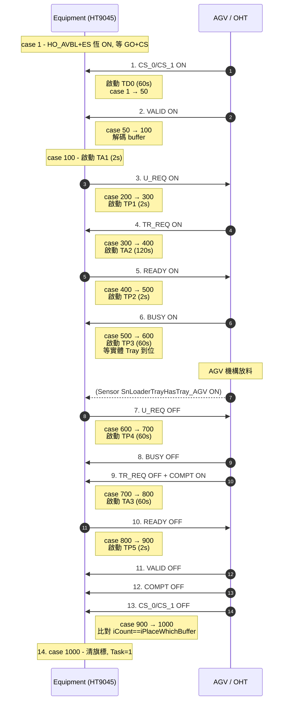
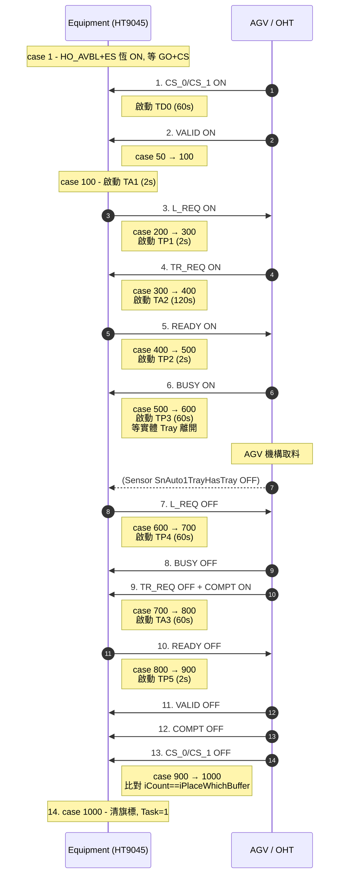

# RD5軟體 — HT9045 V899 SEMI E84 時序圖標註

> 版本：HT9011UC_Code_V3.33.899.0_20260323_Jimmy_20260422
> 對照 SEMI E84 Figure 12 (LOAD) / Figure 13 (UNLOAD) Single Handoff Sequence
> 產生時間：2026-04-23 14:15:00

---

## 圖例
- **Equipment** = HT9045 Handler（Passive，本機）
- **AGV/OHT** = 搬運車（Active）
- 訊號方向：`→` Equipment 主動驅動；`←` AGV 主動驅動
- 計時器：`TD0/TA1/TA2/TA3/TP1/TP2/TP3/TP4/TP5` 全部來自 `D:\HT9045\config\AGV.ini`

---

## Figure 12 — LOAD（AGV → Handler，把 Tray 送進 Loader/Empty/Color）

對應程式：[Automation/AGV.cpp `DoE84Loader()`](../HT9011UC_Code_V3.33.899.0_20260323_Jimmy_20260422/Automation/AGV.cpp#L226)

### LOAD 異常分歧
| 出口 | 觸發 | 動作 |
|------|------|------|
| `case 50 → 5000` | TD0 內 VALID 未到 | `btInitalLoad->Click()` reset |
| `case 200 → 5000` | TA1 內 UREQ 未驅動 | reset |
| `case 300 → 5000` | TP1 內 TRREQ 未到 | reset |
| `case 400 → 5000` | TA2 內 READY 未驅動 | reset |
| `case 500 → 5000` | TP2 內 BUSY 未到 | reset |
| `case 600 → 5000` | TP3 內 Tray 物理感測未 ON | reset |
| `case 700 → 5000` | TP4 內 TRREQ↓+COMPT↑ 未滿足 | reset |
| `case 800 → 5000` | TA3 內 READY 未撤 | reset |
| `case 900 → 5000` | TP5 內 VALID/COMPT/CS 未全 OFF | reset |
| `case 900 → 2000` | 收尾 CS 與起始 buffer 不一致 | 跳對話框「是否要修改 Port 狀態?」**會阻塞 Auto** |

---

## Figure 13 — UNLOAD（Handler → AGV，從 Auto1/2/3 取走 Tray）

對應程式：[Automation/AGV.cpp `DoE84Unloader()`](../HT9011UC_Code_V3.33.899.0_20260323_Jimmy_20260422/Automation/AGV.cpp#L588)

> UNLOAD 與 LOAD 的差異：
> 1. 訊號 `U_REQ` ? `L_REQ`（[L709](../HT9011UC_Code_V3.33.899.0_20260323_Jimmy_20260422/Automation/AGV.cpp#L709)）
> 2. case 600 等 Tray sensor `IsOff()`（[L797](../HT9011UC_Code_V3.33.899.0_20260323_Jimmy_20260422/Automation/AGV.cpp#L797)）
> 3. Buffer 名稱 Auto1/2/3、cylinder `C_Auto1_Selector` 等

---

## CS 編碼速查（9045 自訂，**非 SEMI 標準**）

| CS_0 | CS_1 | `iPlaceWhichBuffer[]` | LOAD 對應 | UNLOAD 對應 |
|:----:|:----:|:---------------------:|:---------:|:-----------:|
| ON   | OFF  | 0 | Loader | Auto 1 |
| OFF  | ON   | 1 | Empty | Auto 2 |
| ON   | ON   | 2 | Color | Auto 3 |
| OFF  | OFF  | 10 (sentinel) | 等待中 | 等待中 |

---

## 計時器索引總表

`TestIF_File.iE84TimeOut_K12[port][idx]`，port=0 (Loader) / 1 (Unloader)，秒為單位。

| idx | 標籤 | LOAD 用途 | UNLOAD 用途 | 預設 |
|:---:|:----:|----------|-------------|:----:|
| 0 | TP1 | 等 TR_REQ ON | 同 LOAD | 2 |
| 1 | TP2 | 等 BUSY ON | 同 | 2 |
| 2 | TP3 | 等 Tray IsOn | 等 Tray IsOff | 60 |
| 3 | TP4 | 等 TR_REQ↓+COMPT↑ | 同 | 60 |
| 4 | TP5 | 等 VALID/COMPT/CS 全 OFF | 同 | 2 |
| 5 | TP6 | （未使用） | — | 2 |
| 6 | TA1 | 等驅 U_REQ | 等驅 L_REQ | 2 |
| 7 | TA2 | 等驅 READY | 同 | 120 |
| 8 | TA3 | 等撤 READY | 同 | 60 |
| 9 | TD0 | CS valid 最大延遲 | 同 | 60 |
| 10 | TD1 | （未使用） | — | 60 |

> UI 設定位置：`fAGV` 表單的 `edE84_1_TPx / TAx / TDx` 與 `edE84_2_*`，存檔到 `D:\HT9045\config\AGV.ini`。
