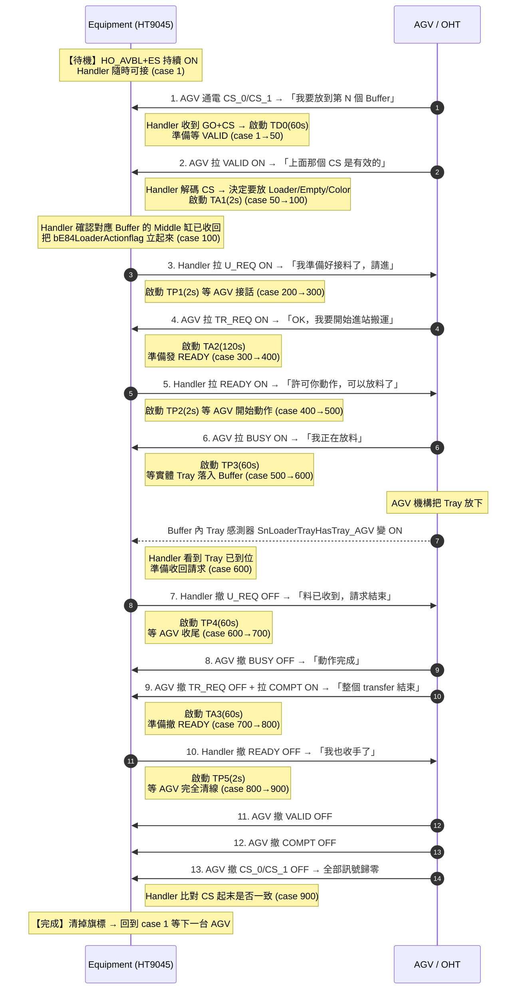
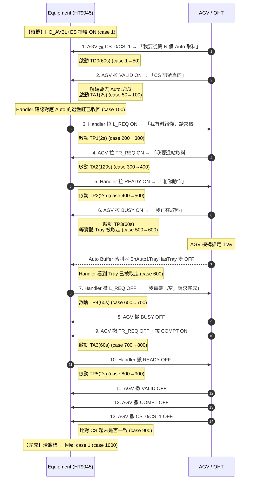

# RD5軟體 — HT9045 V899 SEMI E84 時序圖標註（口語化版）

> 版本：HT9011UC_Code_V3.33.899.0_20260323_Jimmy_20260422
> 對照 SEMI E84 Figure 12 (LOAD) / Figure 13 (UNLOAD) Single Handoff Sequence
> 產生時間：2026-04-23 14:30:00

---

## 圖例
- **Equipment** = HT9045 Handler（Passive，本機）
- **AGV/OHT** = 搬運車（Active）
- 時序圖中文字直接說明「現在做什麼事」，括號內附對應的 case 編號方便對照原始碼
- 計時器：`TD0/TA1/TA2/TA3/TP1/TP2/TP3/TP4/TP5` 全部來自 `D:\HT9045\config\AGV.ini`

---

## Figure 12 — LOAD（AGV → Handler，把 Tray 送進 Loader / Empty / Color）

對應程式：[Automation/AGV.cpp `DoE84Loader()`](../HT9011UC_Code_V3.33.899.0_20260323_Jimmy_20260422/Automation/AGV.cpp#L226)

### LOAD 各 case「在做什麼」

| case | 一句話說明 | 主要動作 / 等待條件 | 啟動的計時器 | 下一步 |
|:----:|------------|---------------------|:------------:|:------:|
| **1** | **待機等車** | Handler 持續廣播「我可以接（HO_AVBL+ES ON）」；偵測到 AGV 的 GO 訊號**且** CS_0 或 CS_1 有 ON | TD0(60s) | 50 |
| **50** | **等 AGV 確認** | 等 AGV 拉 VALID（告訴我「我剛剛給的 CS 是真的，不是雜訊」） | — | 100 |
| **100** | **解碼放哪裡** | 看 CS_0/CS_1 組合決定要放 Loader(0) / Empty(1) / Color(2)；確認該 Buffer 的中間定位缸已收回 | TA1(2s) | 200 |
| **200** | **舉手說我準備好** | Handler 把 U_REQ 拉 ON，告訴 AGV「請進來放料」 | TP1(2s) | 300 |
| **300** | **等 AGV 答覆** | 等 AGV 把 TR_REQ 拉 ON 表示「我要開始 transfer」 | TA2(120s) | 400 |
| **400** | **發出許可** | Handler 拉 READY ON，正式批准 AGV 動作 | TP2(2s) | 500 |
| **500** | **等 AGV 開始動作** | 等 AGV 拉 BUSY ON，並把當下 CS 編碼存起來（`iCount`）作為「答案」之後驗證 | TP3(60s) | 600 |
| **600** | **等實體放料完成** | 等對應 Buffer 的 Tray 感測器 IsOn（Tray 真的進來了），確認後撤 U_REQ OFF | TP4(60s) | 700 |
| **700** | **等 AGV 結束** | 等 AGV 同時：TR_REQ 撤 OFF + COMPT 拉 ON | TA3(60s) | 800 |
| **800** | **撤回許可** | Handler 撤 READY OFF；若途中 CS 又變化會重新存 `iCount` | TP5(2s) | 900 |
| **900** | **驗收歸零** | 等 VALID/COMPT/CS_0/CS_1 全部 OFF；比對 `iCount` 是否等於起始 buffer，一致 → 1000，否則 → 2000 | — | 1000 / 2000 |
| **1000** | **完成歸位** | 清 `bE84LoaderActionflag` / `bE84Loaderflag`，回到 case 1 等下一車 | — | 1 |
| **2000** | **buffer 不一致警示** | 跳對話框「AGV Place To X, Start Buffer is Y, 是否要修改 Port 狀態?」**會阻塞自動運轉**，操作員按 OK 後採用最後 CS 編碼 | — | 2100 |
| **2100** | **強制完成** | 印 Log 後接到 case 1000 結束 | — | 1000 |
| **5000** | **異常 Recover** | 任何上面 case 計時器到期都跳這裡，呼叫 `btInitalLoad->Click()` 把 Task 重設回 1（**目前沒有顯式 OFF U_REQ/READY，殘留訊號要小心**） | — | 1 |

### LOAD 異常分歧速查

| 哪個 case 卡住 | 真正原因 | 結果 |
|:--------------:|----------|------|
| case 50 超時 | TD0 內 AGV 一直沒拉 VALID | 訊號接觸不良 / AGV 未到位 → 5000 reset |
| case 200 超時 | Handler 自己 U_REQ 沒驅動成功 | IO 卡或軟體 bug → 5000 |
| case 300 超時 | TP1 內 AGV 沒給 TR_REQ | AGV 端 timeout 設太短 / 通訊斷 → 5000 |
| case 400 超時 | Handler READY 驅動失敗 | IO 卡 → 5000 |
| case 500 超時 | TP2 內 AGV 沒拉 BUSY | AGV 機構故障 → 5000 |
| case 600 超時 | TP3 內 Tray 沒落入 Buffer 感測位置 | **常見**：Tray 沒對準 / 感測器髒 → 5000 |
| case 700 超時 | TP4 內 TR_REQ 沒撤 或 COMPT 沒到 | AGV 收尾異常 → 5000 |
| case 800 超時 | TA3 內 Handler READY 撤不掉 | IO 異常 → 5000 |
| case 900 超時 | TP5 內 AGV 訊號沒清乾淨 | AGV 線路殘留電位 → 5000 |
| case 900 → 2000 | CS 收尾編碼跟起始不一樣 | 被質疑放錯 buffer → **跳對話框阻塞** |

---

## Figure 13 — UNLOAD（Handler → AGV，從 Auto1 / Auto2 / Auto3 取走 Tray）

對應程式：[Automation/AGV.cpp `DoE84Unloader()`](../HT9011UC_Code_V3.33.899.0_20260323_Jimmy_20260422/Automation/AGV.cpp#L588)

> 整個結構與 LOAD 幾乎一樣，**差異只有三處**：
> 1. Handler 改用 **L_REQ** 訊號（不是 U_REQ）告訴 AGV「我有料給你」
> 2. case 600 的等待條件從「Tray 感測器 IsOn」改成「**IsOff**」（因為 AGV 是把 Tray 取走）
> 3. Buffer 名稱：Auto1 / Auto2 / Auto3（取代 Loader/Empty/Color）

### UNLOAD 各 case「在做什麼」

| case | 一句話說明 | 主要動作 / 等待條件 | 啟動的計時器 | 下一步 |
|:----:|------------|---------------------|:------------:|:------:|
| **1** | **待機等車** | 持續廣播 HO_AVBL+ES；偵測 GO + (CS_0\|CS_1) | TD0(60s) | 50 |
| **50** | **等 AGV 確認** | 等 VALID ON | — | 100 |
| **100** | **解碼從哪取** | 看 CS 組合決定 Auto1(0) / Auto2(1) / Auto3(2)；同時記住三個 Auto 此刻的有料狀態（`bSensorStatus[]`） | TA1(2s) | 200 |
| **200** | **舉手說我有料** | Handler 拉 **L_REQ** ON | TP1(2s) | 300 |
| **300** | **等 AGV 答覆** | 等 TR_REQ ON | TA2(120s) | 400 |
| **400** | **發出許可** | 拉 READY ON | TP2(2s) | 500 |
| **500** | **等 AGV 動作** | 等 BUSY ON，並記下 CS 編碼到 `iCount` | TP3(60s) | 600 |
| **600** | **等實體取料完成** | 等對應 Auto 感測器 **IsOff**（Tray 已被取走），確認後撤 L_REQ OFF | TP4(60s) | 700 |
| **700** | **等 AGV 結束** | 等 TR_REQ↓ + COMPT↑ | TA3(60s) | 800 |
| **800** | **撤回許可** | 撤 READY OFF | TP5(2s) | 900 |
| **900** | **驗收歸零** | 等 VALID/COMPT/CS 全 OFF；比對 `iCount` vs 起始 buffer | — | 1000 / 2000 |
| **1000** | **完成歸位** | 清旗標回 case 1 | — | 1 |
| **2000** | **buffer 不一致警示** | 跳對話框詢問是否修改 Port | — | 2100 |
| **2100** | **強制完成** | 印 Log → 跳到 1000 | — | 1000 |
| **5000** | **異常 Recover** | 任何 timeout 進來 → `btInitalUnLoad->Click()` reset | — | 1 |

---

## CS 編碼速查（9045 自訂，**非 SEMI 標準**）

| CS_0 | CS_1 | `iPlaceWhichBuffer[]` | LOAD 對應 | UNLOAD 對應 |
|:----:|:----:|:---------------------:|:---------:|:-----------:|
| ON   | OFF  | 0  | Loader | Auto 1 |
| OFF  | ON   | 1  | Empty  | Auto 2 |
| ON   | ON   | 2  | Color  | Auto 3 |
| OFF  | OFF  | 10 (sentinel) | 等待中 | 等待中 |

> ?? SEMI 標準裡 CS_0、CS_1 是各自獨立的 port 選擇位元，9045 把「兩個同時 ON」當成第三個 buffer，**AGV 端必須客製化配合**。

---

## 計時器索引總表

`TestIF_File.iE84TimeOut_K12[port][idx]`，port=0 (Loader) / 1 (Unloader)，秒為單位。

| idx | 標籤 | 白話說明 | LOAD 用途 | UNLOAD 用途 | 預設 |
|:---:|:----:|----------|----------|-------------|:----:|
| 0 | TP1 | Handler 拉 REQ 後等 AGV 給 TR_REQ 的最大時間 | 等 TR_REQ ON | 同 LOAD | 2 |
| 1 | TP2 | 發 READY 後等 AGV 開始 BUSY | 等 BUSY ON | 同 | 2 |
| 2 | TP3 | BUSY 期間等實體 Tray 完成的最大時間 | 等 Tray IsOn | 等 Tray IsOff | 60 |
| 3 | TP4 | 撤 REQ 後等 AGV 給 COMPT/撤 TR_REQ | 同 | 同 | 60 |
| 4 | TP5 | 撤 READY 後等 AGV 完全清線 | 同 | 同 | 2 |
| 5 | TP6 | （宣告但程式未使用） | — | — | 2 |
| 6 | TA1 | 解碼 CS 後到拉 REQ 之間的最大時間 | 等驅 U_REQ | 等驅 L_REQ | 2 |
| 7 | TA2 | 收到 TR_REQ 後到拉 READY 的最大時間 | 等驅 READY | 同 | 120 |
| 8 | TA3 | 收到 COMPT 後到撤 READY 的最大時間 | 同 | 同 | 60 |
| 9 | TD0 | CS 變化到 VALID ON 的最大延遲 | 同 | 同 | 60 |
| 10 | TD1 | （宣告但程式未使用） | — | — | 60 |

> UI 設定位置：`fAGV` 表單的 `edE84_1_TPx / TAx / TDx` 與 `edE84_2_*`，存檔到 `D:\HT9045\config\AGV.ini`。

---

## 對應 SEMI 標準的 Step 編號（供與 Figure 12/13 對照）

| SEMI Step | 動作 | LOAD case | UNLOAD case |
|:---------:|------|:---------:|:-----------:|
| 1 | CS_0/CS_1 ON | 1 | 1 |
| 2 | VALID ON | 50 | 50 |
| 3 | L_REQ / U_REQ ON | 200 | 200 |
| 4 | TR_REQ ON | 300 | 300 |
| 5 | READY ON | 400 | 400 |
| 6 | BUSY ON | 500 | 500 |
| 7 | L_REQ / U_REQ OFF | 600 | 600 |
| 8 | BUSY OFF | 700 | 700 |
| 9 | TR_REQ OFF + COMPT ON | 700 | 700 |
| 10 | READY OFF | 800 | 800 |
| 11 | VALID OFF | 900 | 900 |
| 12 | COMPT OFF | 900 | 900 |
| 13 | CS_0/CS_1 OFF | 900 | 900 |
| 14 | Cycle End | 1000 | 1000 |
